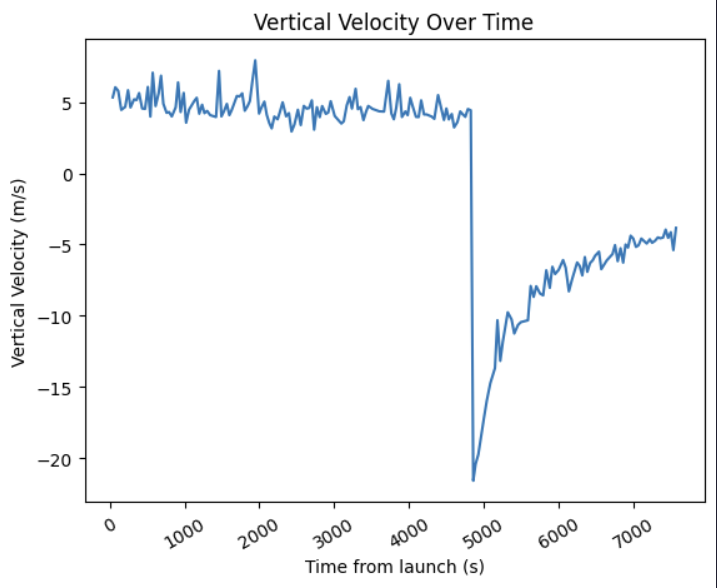

# `Balloon` Class

The following class creates a new tracker for a balloon, and is responsible for stepping a balloon through its flight (`tick`ing). No physical quantities about the balloon are identified, and are considered covered by the noise that is added to every changing variable about the balloon.

The flight of the balloon has 3 states, defined in the `BalloonStatus` enum:

- **Ascent**: During ascent, the balloon rises  up to its max altitude (can be modified).
- **Pop**: The pop phase lasts for only one tick, and is when the balloon bursts due to not enough external pressure.
- **FALL**: The phase after the pop phase, which exists until the balloon hits the ground.

The horizontal position of the balloon is dictated by the vectors provided by the wind map. A sum of the surrounding vectors is taken to determine the direction and magnitude of the wind at that point. Noise is added to this sum to account for variances in irregular wind patterns, and dynamics of the balloon. 

The vertical position of the balloon is determined based on velocity obtained from historical high-altitude balloon flights. This data is from our lab's stratospheric team, *Strato*.



During the first phase of flight (`BalloonStatus.ASCENT`), the vertical velocity is maintained around 5m/s, with random noise added considering the dynamics of flight. During the second phase (`BalloonStatus.POP`), the vertical velocity immediately dips to a value between -18m/s and -21m/s, and in the last phase (`BalloonStatus.FALL`) increases as a function of:

$$f(t) = -15 \cdot (1 + e^{-0.000001(t-t_{pop})}) + 10$$

## Initialization

```py
MyBalloon = Balloon(wm=WindMap(), # an instance of the WindMap class
                    name='Example', # Used for plot legends
                    color='red') # Matplotlib color
```

## Methods

### Balloon.distance_traveled(time)

Calculates the total distance traveled at a given time. If time is `False`, then calculate the total distance over the entire flight.

### Balloon.diagnostic()

Prints some diagnostic information about the balloon at the current time in flight. Provides name, status, altitude, velocity (z-component), and distance traveled.

### Balloon.set_start_pos(x, y)

Set the start point of the balloon at the given coordinate on the wind map assigned to the balloon.

### Balloon.tick()

Progress the balloon through one time interval of flight. The time interval can be modified in the [default.py](/components/defaults.py) file.

## Balloon Data

- `name`: Name of the balloon
- `color`: Matplotlib color
- `coordinates`: list of 3-element lists matching (x,y,z) coordinates
- `altitudes`: list of floats (in meters)
- `current_xy`: Current (x,y) coordinate, in a list
- `current_v`: Current velocity in component form (x,y,z)
- `current_alt`: Current altitude as a float
- `current_status`: One of three states of the BalloonStatus enum
- `attitudes`: ($\phi$, $\theta$) denoting a pointing vector (in degrees) for the active face of the balloon